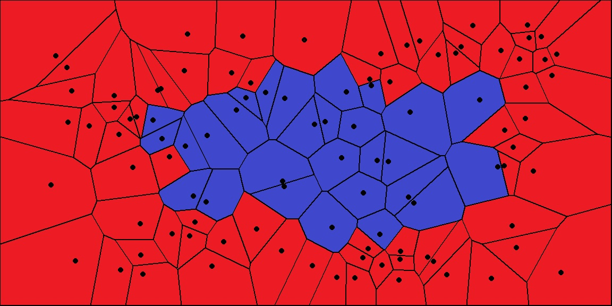

Voronoi Volume
==============

In this example, we generate a volumetric 3D grid with a Distance attribute for each point (voxel).
We will create a model of extracted iso-surfaces, which represents the volumetric data as a :doc:`../generated/vivid3d.Model`.

.. jupyter-execute::

    import vivid3d
    import numpy as np

    #make the data
    BOX_SIZE = 30

    #make 3d grid
    arr = np.arange(-BOX_SIZE, BOX_SIZE, 2)
    ones = np.ones((len(arr), len(arr), len(arr)))
    arrX = arr.reshape(-1, 1, 1) * ones
    arrY = arr.reshape(1, -1, 1) * ones
    arrZ = arr.reshape(1, 1, -1) * ones
    # set points
    points = np.array(list(zip(arrX.reshape(-1), arrY.reshape(-1), arrZ.reshape(-1))))
    # set color field by Z value
    color = arrZ.reshape(-1)
    # Get distance from zero to each point (We will make our surface with this)
    distance = np.linalg.norm(points - np.zeros((1, 3)), axis=1).reshape(-1)

The Voronoi Algorithm
---------------------

The Voronoi algorithm is a cousin of the `Delaunay Triangulation <https://en.wikipedia.org/wiki/Delaunay_triangulation>`_ method.

The

The one liner
-------------

Here we use the distance from 0,0,0 as a field value and with a threshold of 20, we made a surface.

.. jupyter-execute::

    #     model = vivid3d.make_model(
    #        input_points=points, #the 3D points form which faces are made
    #        surface_field = distance, #surface_field, Value for each input_point to later make a surface
    #        surface_threshold = 20, #The threshold value for surface_field, resulting in the surface.
    #        #output_path = path + "/MyFirstModel", #optinal - output path for model
    #        color_field = color, #optinal - Color value for each input point
    #        color_field_min = -BOX_SIZE, #optinal - Min value for the color field, default is min(color_field)
    #        color_field_max = BOX_SIZE, #optinal - Max value for the color field, default is max(color_field)
    #        label = "My_First_Model", #optinal - label for the model, some formats support it
    #        opacity = 0.8, #optinal - opacity factor for the model 0 is See throgh
    #        file_type = "glb", #optinal - file format for the export, basic is "gltf2"
    #        noise_displacement = 0.0001) #Optional, add noise to the model, improves Voronoi performance, recommend leaving as default
    #     model.show()
    print("nothing here yet")

More control
------------

For the second method, we will use a mask and utilize some other abilities of the code.

.. jupyter-execute::

   #we will make two masks for two meshes
   mask1 = np.array(distance) > 25 
   mask2 = np.array(distance) > 15

   #create the faces by running Voronoi, this might be a heavy function
   voronoi = vivid3d.VoronoiVolume(points, color) #make VoronoiVolume obj

   #make a mesh and take a surface by mask
   mesh1 = voronoi.iso_surface(mask1, "Mesh", 0.5)
   mesh2 = voronoi.iso_surface(mask2, "Mesh", 1)
   mesh1.smooth()
   mesh1.show()
   #make a model with our two meshes
   #model = vivid3d.Model([mesh1,mesh2])
   #model.show()
   # export
   # model.export(path+"/MyModel", "gltf2")

Now we have a cool model.

